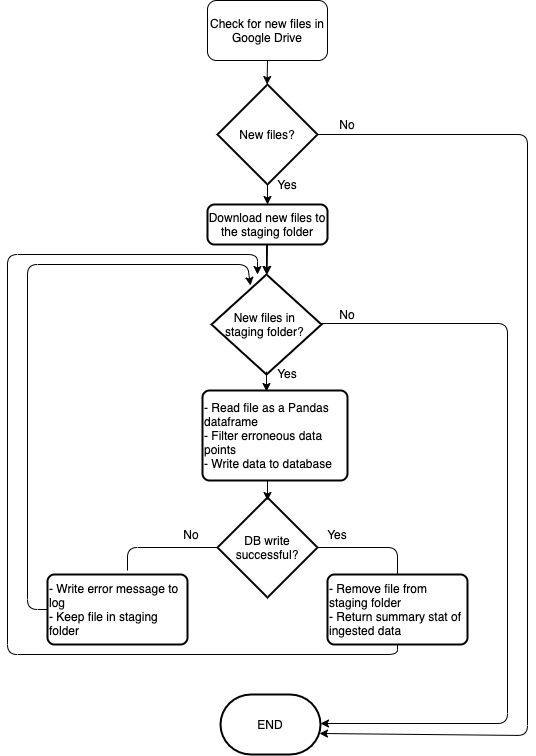

### Table of Contents
1. [Introduction](README.md#introduction)
1. [The approach in this repository](README.md#The-approach-in-this-repository)
1. [Filtering measurement errors and identifying the three machine states](Filtering-measurement-errors-and-identifying-the-three-machine-states)
1. [Setup using an Amazon EC2 instance](README.md#Setup-using-an-Amazon-EC2-instance)
1. [Next steps](README.md#Next-steps)

### Introduction
Machines can be in one of three states. In a *normal* mode a machine operates as it should and measured data behaves in a predictable way with moderate noise. In the second, *faulty*, state the measured data behaves differently. Finally, in the *failed* state all measurements are close to zero

The goal:
- Get csv files containing sensor readings from Google Drive, filter out erroneous readings and map the data into a database
- Identify the time epoches at which the machines change state (from *normal* to *faulty* then to *failed*) by analyzing the cleaned data

### The approach in this repository

The following flowchart illustrates the approach used in this repository to achieve the goals 
<center></center>
 
[Timescaledb](https://www.timescale.com/) is chosen as the database for the following reasons
Why Timescaledb:
- It has built in functions such as ```time_bucket``` that are handy for querying time series data
- It is built as an extension of Postgres which is one of the popular open source DBMS with rich developer community. 
- For time series data, [it scales well](https://blog.timescale.com/blog/timescaledb-vs-6a696248104e/) in comparison to Postgres

Like other relational databases, coping with schema change and scalability are concerns one needs to consider with timescaledb.

### Filtering measurement errors and identifying the three machine states 

Before writing the measurement data, we need to check it for possible outliers. The following figure shows histograms of all four types of metrics collected for machine 1.

<center></center>

The histograms show that most of the data points fall in between -100 and 100 with some outliers.

Filtering out those outliers and focusing on the values between -100 and 100, we can see three distinct parts in the following scatter plot. 

<center></center>

In the left part, roughly for measurement taken before 06/2020, the machine is operating normally with the measurements showing moderate variation. In the middle part, in between 06/2020 and 08/2020, the measurements show more variation while the machine enters a faulty mode. In the rightmost part, all readings are close to zero and the machine is in failed mode.

One approach for detecting and preventing failure is by calculating the variation over time and sending alerts when the variation increasing beyond some threshold.

The following figure shows a seven-day rolling standard deviation of all four metrics for machine 1. All of them show the relay qualitative message that the rolling standard deviation ramps up in the faulty state before going to near-zero in the failed state.

<center></center>

### Setup using an Amazon EC2 instance
To run the code in this repository on an Amazon EC2, follow these steps.
- In the terraform directory run
    ```terraform
    terraform init
    terraform plan
    terraform apply
    ```
- This will 
    - Launch an EC2 instance with ```timescaledb``` preinstalled in it
    - Clone this repository
    - Setup the necessary python environmnet

- Configure the database as follows
    - Create a database user and grant it a superuser access so that it 
can enable the timescaledb extension
    - create a database and schema with name ```example_co```
    - Save the login credentials of the new user in an environment variable named ```DBCON```. For example,
    ```bash
    export DBCON='{"database": "example_co", "user": "user", "password": "password"}'
    ```

- Then follow the instructions on [this](https://developers.google.com/drive/api/v3/quickstart/python) page (only step 1) to enable access to the Google Drive where the csv files are saved.

- Finally, run the python code as follows to setup the database and ingest csv files from Google Drive to the database.
    ```python
    python database_util.py
    python ingress.py
    ```

### Next steps