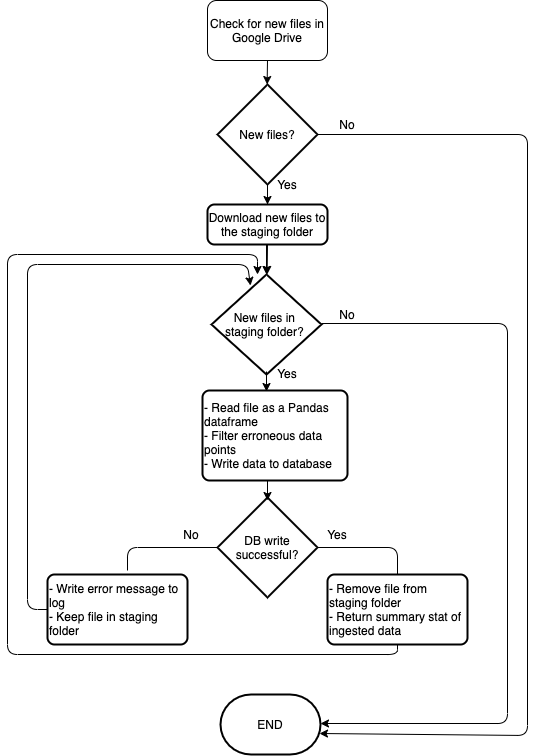
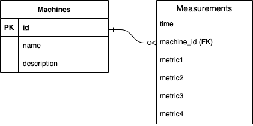

- The setting:
    - A time series dataset containing four types of measurements taken from 20 machines
    - The dataset is in a csv format and it is stored in a Google Drive folder
    - Each file in the Google Drive folder contains five columns, one for the timestamp and four 
    for the metrics being measured
    - Each machine can be in one of the *normal*, *faulty* or *failed* states

- The problem:
    - Filter erronous data from the csv files and write data to DB
    - Devise a method to identify machine state based on the measured time series data

- My approach:
    - Fetch NEW files from Google Drive and place them in a staging folder
    - Read new files one by one, filter them and write cleaned data in DB
    - Remove successfully processed files from the staging folder
    - Log database writing errors, if any, and keep the corresponding file in staging folder

    

    - The database schema has two tables: machines & measurements
    - machine_id links the two tables 
    - Chose Timescaledb because it is a relational database but still scales well for time series data
    compared to other generic relational databases

    

<!---
- Limitations
    - If filename structure changes from machine_\[x\].csv the script cannot extract the machine id from the filename. Hence, nothing will be written to database
    - If the order of columns in  the dataframe changes from *time, column1, column2, ..* either the pd.read_csv method will encounter error or the loaded data will be incorrectly interpreted.
    - The filtering function also depends on the order of columns in the dataframe. So it may raise an error if columns are encoutered out of order
    - create_tables method works only if table definition contains only column names & datatype (e.g. if constraints are there that will cause problem)
<!---
> In summary, the script is heavily dependent on the assumption that the data is in 
> the form [time, metric1, metric2, metric3, ...]
--->

- Future direction
    - Build a dashboard (e.g. using Grafana) to visualize recent readings and current state of machines. For example, create a heatmap of machine id vs state
    - 7-day rolling STD - period selected arbitrarily
    - threshold for alarming the start of faulty mode needs to be experimented
    - Alternative approach:
        - use the model: f(t) = w_0 + w_1 * sin(2pi * t/T + phi) + e
        - transform this to linear using the trignometric identity and use linear regression
        - use the regression model to forecast future readings, and alarm if readings are substantially 
        different than forecasted

- Unit test
    - ingress.csv_to_database: 
        - unit test for machine id extraction with correct & wrong filename format
        - check when database insert is successful that response status is 0, summary statistics is correct & file is deleted
        - check when db insert is unsuccessful that error message is logged
    - database_util.insert: Check if rows are appropriately inserted into DB by mocking the DB execution part
    - Other methods in database_util: Skip writing unit test b/c not much value in writing the test when the state of the database cannot be mocked properly
